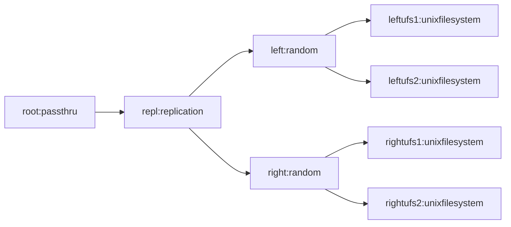

```mermaid
graph LR
0[root:passthru];
0-->1[repl:replication];
1-->2[left:random];
2-->3[leftufs1:unixfilesystem];
2-->4[leftufs2:unixfilesystem];
1-->5[right:random];
5-->6[rightufs1:unixfilesystem];
5-->7[rightufs2:unixfilesystem];
```
